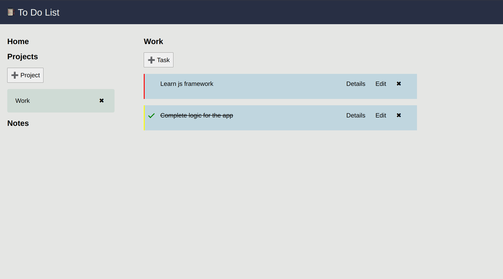

# To Do List

> Live demo [_here_](https://nabelk.github.io/todo-list/).

## Table of Contents

-   [General Info](#general-information)
-   [Built With](#built-with)
-   [Features](#features)
-   [Screenshots](#screenshots)
-   [Room for Improvement](#room-for-improvement)
-   [Contact](#contact)

## General Information

-   The project is a part of The Odin Project: Full Stack JavaScript.
-   A To-Do list is a simple application that allows the user to manage their daily tasks.
-   It comes with notes application.

## Built With

-   Javascript, HTML & CSS.
-   Webpack.
-   Date-fns.
-   Local storage.
-   Prettier && eslint.

## Features

-   Create a new task by entering the title, details, priority, and due date.
-   View all the tasks that have been added to the list.
-   Marking tasks as complete.
-   Delete or edit a task from the list.
-   Create new notes.
-   Edit existing notes.
-   Delete notes.
-   View all notes in a list.
-   The data is stored in the local storage and is retrieved even after the application is closed and reopened.
-   Responsive design for optimal viewing on various devices.

## Screenshots

## Room for Improvement

-   Design a full feature to do list app.

## Contact

Created by [@nabelk](https://www.linkedin.com/in/nabil-khalid-36791a241/) - feel free to contact me!
